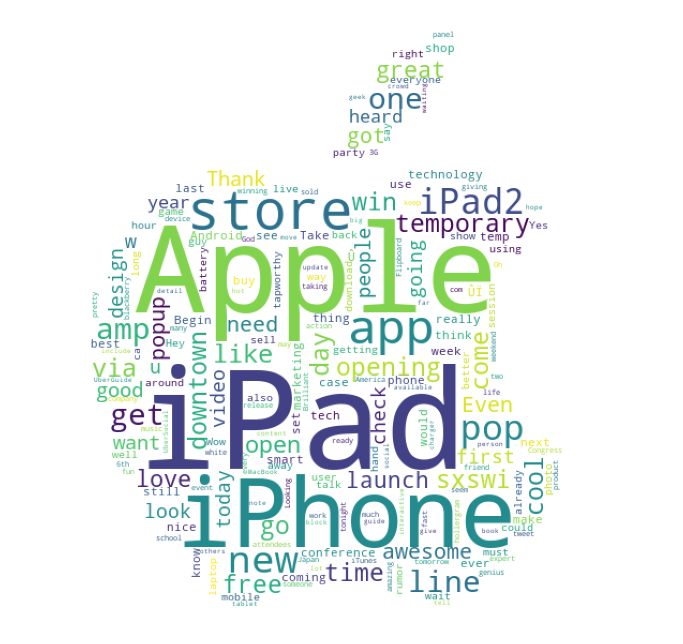
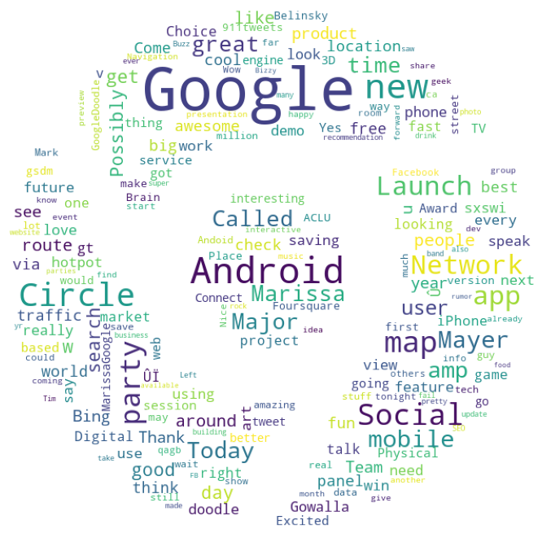
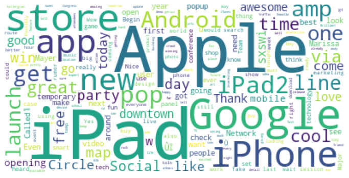
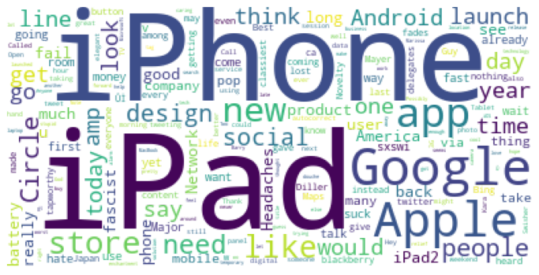

# Classifying SXSW tweets on Sentiment

## Introduction
 We are tasked with classifying tweets from SXSW, Austin, on their sentiment.
 
## Objectives
- Construct a classification model
- Explore trends in tweets through Natural Language data analysis. 

## Data
Our data contains the tweet text, the product in mention, and the sentiment of the tweet. Sentiment could be split into Neutral, Positive, and Negative. 

## Models
We performed two classifications to classify our tweets. First, we classified tweets on the existence of sentiment, splitting into Neutral and Pos/Neg tweets. Then, we constructed a model that classified Positive versus Negative tweets, finishing our task of classifying all three classes. 
- For our first model, a Gaussian Naive Bayes classifier performed best with a recall score of 89%.
- For our second model, a Random Forest performed best, with a weighted F1 score of 87%.

## Findings

### Tweet trends
We constructed word clouds that show most common words for Apple, Google, Positive tweets, and Negative tweets, respectively. 

### Apple

>This is a wordcloud of the most used words in tweets that referenced Apple

### Google

>This is a wordcloud of the most used words in tweets that referenced Google

### Positive Tweets

>This is a wordcloud of the most used words in Positive Tweets

### Negative Tweets

>This is a wordcloud of the most used words in Negative Tweets

## Recommendations
Because Apple had a larger portion of negative reviews than Google, at 23% compared to Google’s 14%, we recommend that Apple investigate these tweets and attempt to gain more information on where this negativity comes from. 

However, Google would benefit from having a greater share of tweets altogether. Apple was referenced twice as much during SXSW, so a greater marketing strategy may help in closing this gap. 

## Necessary Further Investigations
In order to construct a better model, we need to be provided with data that encompasses a larget sample space. The data provided was from a short time frame, and from a small area. If our model is to be used in situations other than Austin SXSW, it may not perform expectedly. If we were to have a dataset that encompasses the full pool of tweets available, we could construct a model that would be able to perform in far more scenarios, increasing its value. 

